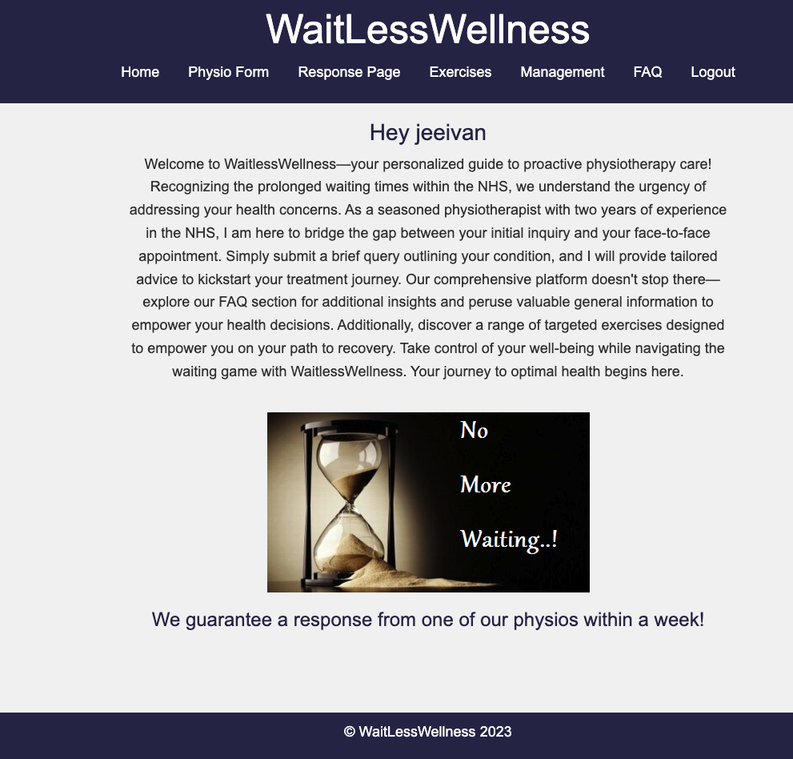

# SEI Unit 4 Project ReadMe



## Project Description

My aim for the final project was to build a full-stack website using a Django backend with PostgreSQL and a React frontend that caters to users in need of physiotherapy. As a former senior physiotherapist, I have firsthand experience with the challenges faced by the NHS, including its extensive waiting lists. Therefore, my plan for this website is to provide a platform where users can not only access general information about managing their symptoms but also submit a brief physiotherapy form. This form will allow me to address the specific needs of each patient, enabling them to initiate their treatment while awaiting a face-to-face appointment.

## Table of Contents

- [Deployment Link](#deployment-link)
- [Technologies Used](#technologies-used)
- [Brief](#brief)
- [Planning](#planning)
- [Build Process](#build-process)
- [Challenges](#challenges)
- [Wins](#wins)
- [Key Learnings/Takeaways](#key-learningstakeaways)
- [Future Improvements](#future-improvements)

## Deployment Link

(https://physio-frontend-production.up.railway.app/)

## I was given just over a week to work on this project and I worked independently to do this with the help of our instructors if I was facing any difficulties.

## Technologies Used

CSS, HTML, Vanilla JavaScript ES6, Django, Django Rest Framework, PostgreSQL,  React, Python

## Brief

**Project Aim:**
Build a full-stack Django/React web app.
Utilise Django as the backend and React as the frontend.
Demonstrate proficiency in designing databases, problem-solving, and seamless data transfer between technologies.

**Technical Requirements:**
Build a full-stack Django/React application.
Connect to and perform data operations on a PostgreSQL database.
Implement full-CRUD data operations across models, excluding the User model.
Authenticate users using Django's built-in authentication.
Implement authorization for data resource operations.
Deploy the app online using Railway.

## Planning

**Page Descriptions:**

**Home Page:**
Personalised narratives about the creator's experiences.
Addressing the issues of NHS waiting times, emphasising the need for concise information.
Encouragement for users to consult a GP for in-depth concerns.
Disclaimer section to set expectations.

**FAQ Page:**
Common questions with collapsible answers for a clean user experience.
Questions covering exercise in pain, diagnosis requirements, posture, etc.

**Exercise Page:**
General information on exercises for back pain.
Video links embedded for visual guidance.

**Management Page:**
Information on how to manage various physio conditions.

**Physio Form Page:**
Subjective Form with CRUD functionality.
Questions include body part selection, history, trauma, pain details, scans, aggravating factors, previous treatments, medications, work impact, goals, etc.

**My Question/Responses Page:**
Display submitted physio forms in a readable layout.
Indicate "Awaiting response" or display responses.
Super users can view all questions; normal users see only their questions.

**Technical Features:**
User Authentication:
Implement a login/sign-up page.
Set limits on query submissions per user.
Admin login for site management.

**Access Control:**
Restrict page access to logged-in users.
Super users have access to all pages and questions.

**Additional Considerations:**

**Home Page Content:**
Discuss personal experiences.
Address NHS waiting time issues.
Emphasise the site's purpose of providing concise information.

**User Interaction:**
Utilise collapsible sections for FAQs.
Embed video links for exercises.

**Form Functionality:**
Enable CRUD functionality for submitted forms.
Limit query submissions to prevent misuse.

**User Management:**
Distinguish between regular and super users.
Admin access for site administration.

**Database Structure:**
My database employs a one-to-many relationship from users to physio forms, reflecting the scenario where a user can possess multiple physio forms. Conversely, each physio form is linked to a single user, establishing a many-to-one relationship. Additionally, a one-to-one relationship exists between the physio form and the treatment entity. This design ensures that each physio form is associated with a singular treatment, offering a streamlined and efficient relationship model.


## Build Process

**Day 1**

- Today I was able to setup the django back end along with the django rest framework
- I was also able to connect this with the front end and was successfully able to fetch data from the back end and display this into the back end
- I am also pleased I was able to embed youtube videos showing specific exercises onto my exercise page which I am pleased with as this way it is able to keep the users on my site rather them leaving the page to go see the youtube video and they have access to all their exercise videos in one page
  
![screenshot of exercise page)(exercise.png)

- Initially I was having some trouble with setting up the CRUD functionality in my back end and particularly with the routes
- I was able to fix this by changing the routes and got rid of any extra slashes I used in the end points as this was what was causing errors and after testing these in postman I was successfully able to create, read, update and delete both responses and the physio form data too

**Day 2**

- I created a new page focussed on management advice- this was fairly straightforward as it is just a static page with information
- I also created separate components for my exercise videos to keep the code more readable
- To make the page more dynamic I added buttons for each body part and that way whichever body part is clicked on by the user it will only display the videos from that component

```
export default function Exercise() {
        const [showModal, setShowModal] = useState(true);
        const [selectedBodyPart, setSelectedBodyPart] = useState(null)

        const handleBodyPartClick = (bodyPart) => {
            setSelectedBodyPart(bodyPart)
            setShowModal(false)
        }

        const bodyPartHeadings = {
            lowBack: 'Low Back Exercises',
            neck: 'Neck Exercises',
            knee: 'Knee Exercises',
            shoulder: 'Shoulder Exercises',
            hip: 'Hip Exercises',
            ankle: 'Ankle Exercises',
          };

  return (
    <Container>
        <h1>{bodyPartHeadings[selectedBodyPart] || 'Exercises'}</h1>
        <div className="exercise-buttons">
        <Button onClick={() => handleBodyPartClick('lowBack')}>Low Back</Button>
        <Button onClick={() => handleBodyPartClick('neck')}>Neck</Button>
        <Button onClick={() => handleBodyPartClick('knee')}>Knee</Button>
        <Button onClick={() => handleBodyPartClick('shoulder')}>Shoulder</Button>
        <Button onClick={() => handleBodyPartClick('hip')}>Hip</Button>
        <Button onClick={() => handleBodyPartClick('ankle')}>Ankle</Button>
        </div>
        {selectedBodyPart && (
        <>
          {selectedBodyPart === 'lowBack' && <LowBack />}
          {selectedBodyPart === 'neck' && <Neck />}
          {selectedBodyPart === 'knee' && <Knee />}
          {selectedBodyPart === 'shoulder' && <Shoulder />}
          {selectedBodyPart === 'hip' && <Hip />}
          {selectedBodyPart === 'ankle' && <Ankle />}
        </>
      )}

        <Modal show={showModal} onHide={() => setShowModal(false)}>
        <Modal.Header closeButton>
          <Modal.Title>Welcome to the Exercise Page. DISCLAIMER!</Modal.Title>
        </Modal.Header>
        <Modal.Body>
          <p>These exercises serve as examples, and while we cannot guarantee they will alleviate your pain, it's crucial to understand that treatment extends beyond exercises alone. It's worth noting that exercises performed on the floor can also be adapted for bed. It's important to emphasize that there's no such thing as a 'perfect' exercise, and you're not expected to perform every exercise listed here. The key is to discover the exercises that work specifically for you.<br /> Don't feel pressured to adhere to a specific repetition count – focus on what feels comfortable for you. Gradually ease into each exercise and steadily increase repetitions at your own pace. Remember, it's about finding the right exercise tailored to your needs. So, don't worry about the quantity; prioritize comfort and gradual progress.</p>
        </Modal.Body>
        <Modal.Footer>
          <Button variant="primary" onClick={() => setShowModal(false)}>
            Close
          </Button>
        </Modal.Footer>
      </Modal>
    </Container>
  )
}
```

**Day 3**

- Now that I had the create user working I then needed a way to be able to get the id of the user to be able to use this id to fetch other pieces of data in my response page
- I was struggling with this at first as I was having trouble figuring out how to do this but after doing some further research I realised i could use the jwt-decode import that could grab the id as shown below
- I then encountered the problem where even though I had the code I needed a way to be able to pass this code to other pages of my website
- At first I attempted to do this using the params but this proved to be quite inefficient and much better approach I worked out was using the localstorage and setting the id in there to be able to access it from any page as also shown below
- Having this ID allowed me to be able to do more fetches for specific pieces of data within the physioform and treatment

```
localStorage.setItem("decoded_token", userId);
```

```
  useEffect(() => {
    async function fetchData() {
      try {
        let apiUrl = `${process.env.REACT_APP_BACKEND_URL}/physioform/`;

        // If the user is not a superuser, fetch only their most recent physioform data
        if (!isSuperUser) {
          apiUrl += `user/${userId}`;
        }

        const response = await fetch(apiUrl, {
          method: "GET",
          headers: {
            "Content-Type": "application/json",
            'Authorization': `Bearer ${localStorage.getItem('access_token')}`,
          },
        });

        const data = await response.json();
```

**Day 4**

- I was able to get my full CRUD working and added edit and delete functions to the physioform information
- With the edit method I was having some trouble with loading the pre-existing data
- I was able to solve this issue by passing the data for that specific physioform data and passing it to the update page

```
export default function PhysioFormUpdate() {
  const [existingData, setExistingData] = useState({});
  const physioFormId = localStorage.getItem("physio_form");
  const isEditMode = !!physioFormId;

  useEffect(() => {
    async function fetchExistingData() {
      try {
        const response = await fetch(`${process.env.REACT_APP_BACKEND_URL}/physioform/${physioFormId}/`, {
          method: 'GET',
          headers: {
            'Content-Type': 'application/json',
            'Authorization': `Bearer ${localStorage.getItem('access_token')}`,
          },
        });
        const data = await response.json();
        setExistingData(data);
      } catch (error) {
        console.error('Error fetching existing data:', error);
      }
    }

    if (isEditMode) {
      fetchExistingData();
    }
  }, [physioFormId, isEditMode]);

  return (
    <div>
      <Form existingData={existingData} isEditMode={isEditMode} />
    </div>
  );
}
```

- Another of my blockers I was facing was that on the response page for the super user it is intended to show the physioform data for all users however whenever first loading onto the page after logging in it would only show one piece of data
- After a lot of debugging I was unable to fix this issue where I originally was using useState to set if the user was a super user 
- Instead I found an alternative way of using localstorage and setting this information to a variable which resolved my issue, which I was pleased with

```
        if (userData.is_staff === true) {
          localStorage.setItem("isSuperUser", "true");
        } else {
          localStorage.setItem("isSuperUser", "false");
        }
```

**Day 5**

- A  blocker I worked on this day was where once the super user completes a treatment for a form data the form data remains in the response page for the super user
- After some thought I made the decision to add an attribute to the form data where treatment_completed is set to false by default initially 
- This way once the treatment method is posted it would update the treatment_completed attribute to true 
- I then made sure in the response page to only filter through data forms that only have treatment completed as false

```
class Physio_Form(models.Model):
  date = models.DateField(auto_now_add=True)
  name = models.CharField(max_length=100)
  age = models.IntegerField()
  body_part = models.CharField(max_length=100)
  time = models.CharField(max_length=15)
  trauma = models.CharField(max_length=100)
  location = models.CharField(max_length=100)
  scans = models.CharField(max_length=100)
  aggs = models.CharField(max_length=100)
  eases = models.CharField(max_length=100)
  past_treatment = models.CharField(max_length=100)
  medication = models.CharField(max_length=100)
  work = models.CharField(max_length=100)
  goals = models.CharField(max_length=100)
  treatment_complete = models.BooleanField(default=False)
  user = models.ForeignKey(User, on_delete=models.CASCADE)
```

```
            if (!isSuperUser) {
              // If the user is not a superuser, sort and get the most recent entry
              const sortedData = data.sort((a, b) => new Date(b.date) - new Date(a.date));
              const mostRecentPhysioformData = sortedData[0];
              setPhysioFormData([mostRecentPhysioformData]);
            } else {
              const physioformsWithoutTreatments = data.filter((physioform) => !physioform.treatment_complete);
              setPhysioFormData(physioformsWithoutTreatments);
              
            }
```

**Day 6**

- I updated my sign up and sign in pages to make them more user friendly as I was having an issue where if someone’s sign in failed there would be no message meaning the user would not know why the login/sign up failed
- I also spent a lot of time today updating the styling of my page, including a focus of adding media queries to make the website mobile friendly too

**Day 7**

- For the final half day of the project I was spending the majority of my time testing the deployed version of my website to make sure there were no bugs
- I spent some time adjusting the styling to make sure the website was as user friendly as possible
- I made a small adjustment in my PhysioForm entity to add an input for the age of the user so this would be clear for the super user giving the user treatment as the age can also affect the treatment advice too

## Challenges

Adding the delete method was relatively straightforward, as I had already set up the back end. I just needed to implement the fetch in the front end. Despite successfully deleting physioform data, a challenge arose when there were no forms left for that user. The page still attempted to render the physioform data, causing a blocker.
After some debugging, I identified that the error occurred because the physioform data was appearing as undefined in the console instead of being represented as an empty array. To address this issue, I implemented the solution by using the line 'if (data.length > 0)'. By incorporating this condition, it ensured that if there was no more physioform data for that user, the physioform would no longer be set with any data, leaving it as an empty array rather than becoming undefined.

```
  useEffect(() => {
    async function fetchData() {
      try {
        let apiUrl = `${process.env.REACT_APP_BACKEND_URL}/physioform/`;

        // If the user is not a superuser, fetch only their most recent physioform data
        if (!isSuperUser) {
          apiUrl += `user/${userId}`;
        }

        const response = await fetch(apiUrl, {
          method: "GET",
          headers: {
            "Content-Type": "application/json",
            'Authorization': `Bearer ${localStorage.getItem('access_token')}`,
          },
        });

        const data = await response.json();

        if (Array.isArray(data)) {
          if (data.length > 0) { 
            if (!isSuperUser) {
              // If the user is not a superuser, sort and get the most recent entry
              const sortedData = data.sort((a, b) => new Date(b.date) - new Date(a.date));
              const mostRecentPhysioformData = sortedData[0];
              setPhysioFormData([mostRecentPhysioformData]);
            } else {
              const physioformsWithoutTreatments = data.filter((physioform) => !physioform.treatment_complete);
              setPhysioFormData(physioformsWithoutTreatments);
              
            }
          } else {
            console.error("Physioform data is not an array:", data);
          }
        }
      } catch (error) {
        console.log("Error fetching physioform data", error);
      }
    }
```

## Wins

- At first I was struggling to be able to differentiate the data for those who were not super users but after doing some digging into my database I came upon the is_staff attribute that contained a boolean that stated if the user was an admin or not
- By adding the is_staff to my fields I was able to access this data through and this allowed me to distinguish if the user was a super user or not
- I am pleased with my code below to render the data differently depending on if the user was a super user or not, although if time allowed I would have gone back through this to make this cleaner

```
  return (
    <div className="container">
      <h1>Physioform Details</h1>
      {physioFormData.length > 0 ? (
        physioFormData.map((formData, index) => (
          <div className="physioform-container" key={index}>
            <strong>Name:</strong>{formData.name}<br />
            <strong>Age:</strong>{formData.age}<br />
            <strong>Date:</strong> {formData.date}<br />
            <strong>Body Part:</strong> {formData.body_part}<br />
            <strong>Time:</strong> {formData.time}<br />
            <strong>Trauma:</strong> {formData.trauma}<br />
            <strong>Location:</strong> {formData.location}<br />
            <strong>Scans:</strong> {formData.scans}<br />
            <strong>Aggravating Factors:</strong> {formData.aggs}<br />
            <strong>Easing Factors:</strong> {formData.eases}<br />
            <strong>Past Treatment:</strong> {formData.past_treatment}<br />
            <strong>Medication:</strong> {formData.medication}<br />
            <strong>Work:</strong> {formData.work}<br />
            <strong>Goals:</strong> {formData.goals}<br />
            {/* <strong>Treatment:</strong> {formData.treatment_complete.toString()}<br /> */}
            {!isSuperUser && (
            <>
              <button className='delete-btn' onClick={handleDeletePhysioForm}>Delete</button>
              <Link to="/form/update">
                <button className='link-btn'>Edit</button>
              </Link>
              <p>{message}</p>
            </>
          )}
            {isSuperUser && (
              <Link to={`/treatments/add/${getIdFromUrl(formData.url)}`}>
                <button className="treatment-btn">Add Treatment</button>
              </Link>
            )}
          </div>
        ))
      ) : (
        <p>You have no physio queries. If you would like to make one then please head to the Physio Form page.</p>
      )}

      {!isSuperUser && treatmentData.length > 0 ? (
        <div className="treatment-details">
          <hr />
          <h2>Treatment Details</h2>
          {treatmentData.map((treatment, treatmentIndex) => (
            <div key={treatmentIndex}>
              <strong>Date:</strong> {treatment.date}<br />
              <strong>Response:</strong> {treatment.response}<br />
            </div>
          ))}
        </div>
      ) : (
        <p>{!isSuperUser ? "" : ""}</p>
      )}
    </div>
  );
}
```


## Key Learnings/Takeaways

- With this being the final project of the course I had become much more confident with stand ups and in my ability to communicate what part of the project I was working on and any blockers I had along with the plan I had for that day
- I am much more confident using Django along with postgreSQL
- With this being the second project using react I also have much more confidence using this for my front end
- With several issues deploying previous projects I most definitely found this project the most straightforward to deploy and was pleased to be able deploy with very few problems

## Future Improvements

- If I had more time I would create another entity for user profile that would include their age so the user would not have to implement this every time they made a query
- I would also include a time for their last query in this entity as currently if the user deletes their query they can make another one therefore bypassing the one month time limit I set
- I would also spend more time to create a comment section at the bottom of the management page so that users have a way of interacting with each other and can even share their personal experiences


